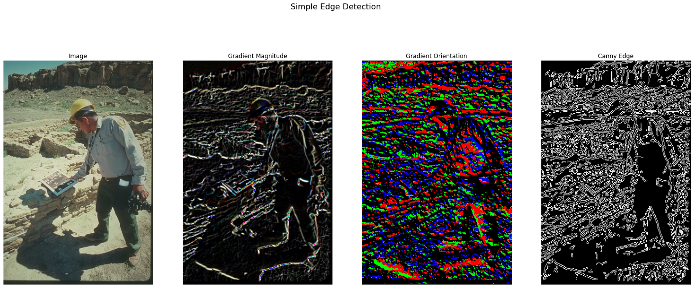
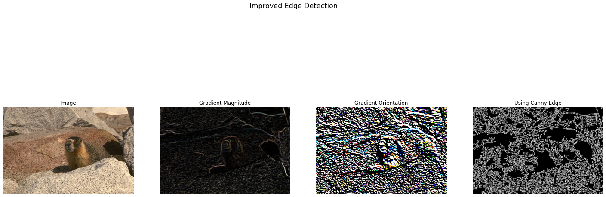
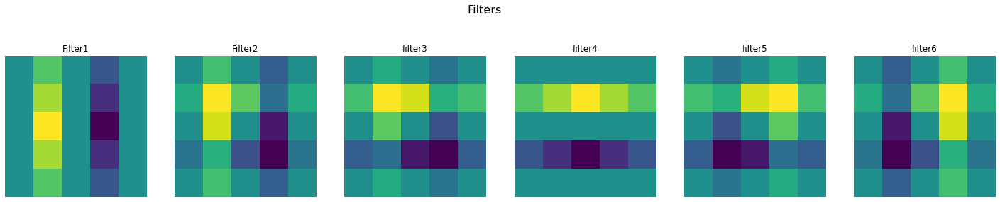

# Edge-Detection
Edge detection includes a variety of mathematical methods that aim at identifying edges, curves in a digital image at which the image brightness changes sharply or, more formally, has discontinuities.  This program explores various methods to approach edge detection

## Overview
The main steps of edge detection are: (1) assign a score to each pixel; (2) find local maxima along the direction perpendicular to the edge. Sometimes a third step is performed where local evidence is propagated so that long contours are more confident or strong edges boost the confidence of nearby weak edges. Optionally, a thresholding step can then convert from soft boundaries to hard binary boundaries. Here are sample outputs.


**Hint:** Reading these papers will help understanding and may help with the programming.

[The design and use of steerable filters](http://people.csail.mit.edu/billf/papers/steerpaper91FreemanAdelson.pdf)

[Berkeley Pb Detector](https://www2.eecs.berkeley.edu/Research/Projects/CS/vision/grouping/papers/mfm-pami-boundary.pdf)

[Multi-scale edge detection](https://home.ttic.edu/~xren/publication/xren_eccv08_multipb.pdf)

# Usage
```
Run the EdgeDetection.ipynb file in Jupyter Notebook or Google Colab
``` 

# Results

<table>
    <tr><td></td></tr>
    <tr><td></td></tr>
    <tr><td></td></tr>
<table>

# Folder Structure
```
📦Edge-Detection
 ┣ 📂Results
 ┃ ┣ 📜output.png
 ┃ ┣ 📜output_1.png
 ┃ ┗ 📜output_3.png
 ┣ 📜.gitignore
 ┣ 📜Edge_Detection.ipynb
 ┣ 📜LICENSE
 ┗ 📜README.md
```